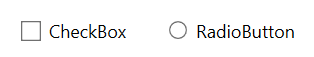
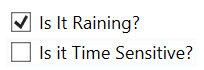
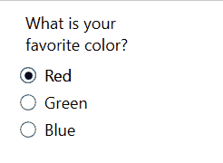
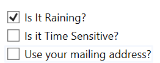
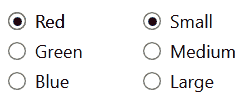

# GA_Prog_2_CheckBoxRadioButton

## What are they?



Check Boxes and Radio Buttons let the user easily choose an answer to a question.

Check box are for questions with an individual yes or no ( true / false ) answer.



Radio Buttons let you choose a single answer from multiple options.



---

## How to use them.

### ***CheckBox***

#### **Adding a CheckBox**

- Drag the CheckBox from the toolbox to your designer.
- You could also add a CheckBox by adding a `<CheckBox />` tag.

```xml
        <CheckBox
            x:Name="chkIsRaining"
            Content="Is It Raining?"
            IsChecked="True" />
```

#### Important Properties
- `x:Name = "checkboxName"`: Name to reference your check box
- `Content = "Message to Display"`: What displays on the label
- `IsChecked = "True"`: Toggles if the check box is checked on unchecked. True = Checked.

#### In Code

If a check box is checked it will return true, else it will return false.

```csharp
    bool isChecked = checkboxName.IsChecked.Value;
```

Make sure to do `IsChecked.Value` otherwise it will give you a type error `is not a bool?`.

**Usage**

Check box responses are used for unrelated answers. So each check box should have it's own if statement.



```csharp
    bool isRaining = chkIsRaining.IsChecked.Value;
    bool isTimeSensitive = chkIsTimeSensitive.IsChecked.Value;
    bool useAddress = chkUseAddress.IsCheck.Value;

    if(isRaining == true) { // Runs if raining is checked }
    if(isTimeSensitive == true) { // Runs if time sensitive is checked }
    if(useAddress == true) { // Runs use mailing address is checked }
```

#### Checking a box with code
You can set which box is check by assigning true to its `.IsChecked` property. **You don't need to do `.Value.`;**

```csharp
    checkBoxName.IsChecked = true;
```
---
### ***Radio Button***

#### **Adding a Radio Button**

- Drag your Radio Buttons from the toolbox to your designer.
- You could also add a Radio Buttons by adding a `<RadioButton />` tag.

```xml
        <RadioButton
            x:Name="rbColorRed"
            Content="Red"
            IsChecked="True" 
            GroupName="nameOfGroup"
            />
```

#### Important Properties
- `x:Name = "radioButtonName"`: Name to reference your Radio Button
- `Content = "Message to Display"`: What displays on the label
- `IsChecked = "True"`: Toggles if the Radio Button is checked on unchecked. True = Checked.
- `GroupName = "Name"`: Giving radio buttons the same group name will group them together, effecting which buttons will be checked / unchecked.

> Example
```xml
<!-- Group Color -->
<RadioButton x:Name="rbRed" Content="Red" GroupName="Color" IsChecked="true"/>
<RadioButton x:Name="rbGreen" Content="Green" GroupName="Color" />
<RadioButton x:Name="rbBlue" Content="Blue" GroupName="Color" />

<!-- Group Size -->
<RadioButton x:Name="rbSmall" Content="Small" GroupName="Size" IsChecked="true"/>
<RadioButton x:Name="rbMedium" Content="Medium" GroupName="Size" />
<RadioButton x:Name="rbLarge" Content="Large" GroupName="Size" />

```




#### In Code

If a check box is checked it will return true, else it will return false.

```csharp
    bool isSelected = radioButtonName.IsChecked.Value;
```

Make sure to do `IsChecked.Value` otherwise it will give you a type error `is not a bool?`.

**Usage**

Radio Button answers are grouped together, so we use an if / else if structure to efficiently write our code.


```csharp
    bool isRed = rbRed.IsChecked.Value;
    bool isGreen = rbGreen.IsChecked.Value;
    bool isBlue = rbBlue.IsCheck.Value;

    if(isRed == true) { // Runs if raining is checked }
    else if(isGreen == true) { // Runs if time sensitive is checked }
    else if(isBlue == true) { // Runs use mailing address is checked }
```

By using an if / else if / else once the option chosen, for example isGreen, is checked for true, the rest of the else ifs won't run.

#### Checking a box with code
You can set which box is check by assigning true to its `.IsChecked` property. **You don't need to do `.Value.`;**

```csharp
    checkBoxName.IsChecked = true;
```

--- 

