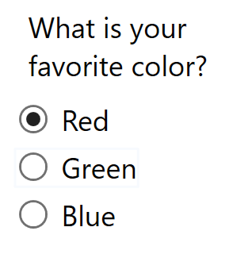
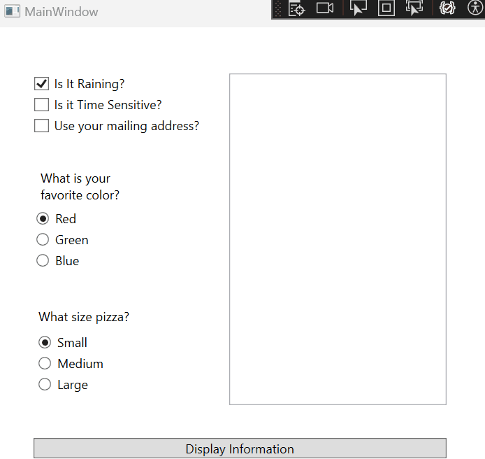

# GA_Prog_2_CheckBoxRadioButton

## What are they?


Check Boxes and Radio Buttons let the user easily choose an answer to a question.

Check box are for questions with an individual yes or no ( true / false ) answer.


Radio Buttons let you choose a single answer from multiple options.


---

## How to use them.

### ***CheckBox***

#### **Adding a CheckBox**

- Drag the CheckBox from the toolbox to your designer.
- You could also add a CheckBox by adding a `<CheckBox />` tag.

```xml
        <CheckBox
            x:Name="chkIsRaining"
            Content="Is It Raining?"
            IsChecked="True" />
```

#### Important Properties
- `x:Name = "checkboxName"`: Name to reference your check box
- `Content = "Message to Display"`: What displays on the label
- `IsChecked = "True"`: Toggles if the check box is checked on unchecked. True = Checked.

#### In Code

If a check box is checked it will return true, else it will return false.

```csharp
    bool isChecked = checkboxName.IsChecked.Value;
```

Make sure to do `IsChecked.Value` otherwise it will give you a type error `is not a bool?`.

**Usage**

Check box responses are used for unrelated answers. So each check box should have it's own if statement.


```csharp
    bool isRaining = chkIsRaining.IsChecked.Value;
    bool isTimeSensitive = chkIsTimeSensitive.IsChecked.Value;
    bool useAddress = chkUseAddress.IsCheck.Value;

    if(isRaining == true) { // Runs if raining is checked }
    if(isTimeSensitive == true) { // Runs if time sensitive is checked }
    if(useAddress == true) { // Runs use mailing address is checked }
```

#### Checking a box with code
You can set which box is check by assigning true to its `.IsChecked` property. **You don't need to do `.Value.`;**

```csharp
    checkBoxName.IsChecked = true;
```
---
### ***Radio Button***

#### **Adding a Radio Button**

- Drag your Radio Buttons from the toolbox to your designer.
- You could also add a Radio Buttons by adding a `<RadioButton />` tag.

```xml
        <RadioButton
            x:Name="rbColorRed"
            Content="Red"
            IsChecked="True" 
            GroupName="nameOfGroup"
            />
```

#### Important Properties
- `x:Name = "radioButtonName"`: Name to reference your Radio Button
- `Content = "Message to Display"`: What displays on the label
- `IsChecked = "True"`: Toggles if the Radio Button is checked on unchecked. True = Checked.
- `GroupName = "Name"`: Giving radio buttons the same group name will group them together, effecting which buttons will be checked / unchecked.

> Example
```xml
<!-- Group Color -->
<RadioButton x:Name="rbRed" Content="Red" GroupName="Color" IsChecked="true"/>
<RadioButton x:Name="rbGreen" Content="Green" GroupName="Color" />
<RadioButton x:Name="rbBlue" Content="Blue" GroupName="Color" />

<!-- Group Size -->
<RadioButton x:Name="rbSmall" Content="Small" GroupName="Size" IsChecked="true"/>
<RadioButton x:Name="rbMedium" Content="Medium" GroupName="Size" />
<RadioButton x:Name="rbLarge" Content="Large" GroupName="Size" />

```


#### In Code

If a check box is checked it will return true, else it will return false.

```csharp
    bool isSelected = radioButtonName.IsChecked.Value;
```

Make sure to do `IsChecked.Value` otherwise it will give you a type error `is not a bool?`.

**Usage**

Radio Button answers are grouped together, so we use an if / else if structure to efficiently write our code.


```csharp
    bool isRed = rbRed.IsChecked.Value;
    bool isGreen = rbGreen.IsChecked.Value;
    bool isBlue = rbBlue.IsCheck.Value;

    if(isRed == true) { // Runs if raining is checked }
    else if(isGreen == true) { // Runs if time sensitive is checked }
    else if(isBlue == true) { // Runs use mailing address is checked }
```

By using an if / else if / else once the option chosen, for example isGreen, is checked for true, the rest of the else ifs won't run.

#### Checking a box with code
You can set which box is check by assigning true to its `.IsChecked` property. **You don't need to do `.Value.`;**

```csharp
    checkBoxName.IsChecked = true;
```

--- 

## Assignment

`Designer`

1. Add 3 Check Boxes
    1. `Content="Is Raining" x:Name="chkRaining"`
    2. `Content="Is it Time Sensitive?" x:Name="chkTimeSensitive"`
    3. One of your choice

    Example:  


2. Add a Label and 3 Radio Buttons
    1. Label: `Content="What is your favorite color?"` 
    2. 3 Radio Buttons ( Content, Name, and Group Name)
        1. `Content="Red" x:Name="rbRed" GroupName="Color"`
        2. `Content="Blue" x:Name="rbBlue" GroupName="Color"`
        3. `Content="Green" x:Name="rbGreen" GroupName="Color"`

    Example:  


3. Add another Label and at least 3 radio buttons
    1. Label: Your choice of question
    2. Your choice of radio buttons. 
        - Make sure to add content, names, and group name.

4. Add a Rich Text Box
    - Give the Run the name of `rtbDisplay`.

5. Add a button
    - `x:Name="btnDisplayInfo" Content="Display Information"`
    - Add a click event

6. In the click event write the code to output the results based on what's clicked.

Example
```csharp
    private void btnDisplayInfo_Click(object sender, RoutedEventArgs e)
    {
        // We will keep appending to this string before we display it to our rich text box.
        string formattedString = "";


        // Grabbing Check Box Information
        bool isRaining = chkRaining.IsChecked.Value;
        bool isTimeSensitive = chkTimeSensitive.IsChecked.Value;
        bool useMailingAddress = chkUseMailing.IsChecked.Value;

        // Here we are appending the results from our check box
        formattedString += $"Is Raining : {isRaining}\n\n";
        formattedString += $"Is Time Sensitive : {isTimeSensitive}\n\n";
        formattedString += $"Use Mailing Address : {useMailingAddress}\n\n";

        // Which Color
        bool isRed = rbRed.IsChecked.Value;
        bool isGreen = rbGreen.IsChecked.Value;
        bool isBlue = rbBlue.IsChecked.Value;

        formattedString += "Your favorite color is ";

        // Using an If Else statement, we display which color is the users favorite
        if(isRed) { formattedString += "red\n"; }
        else if(isGreen) { formattedString += "green\n"; }
        else { formattedString += "blue\n"; }

        // Replace this wil your code
        // Which Size
        bool small = rbSmall.IsChecked.Value;
        bool medium = rbMedium.IsChecked.Value;
        bool large = rbLarge.IsChecked.Value;

        formattedString += "\nYour pizza size is ";

        if (small) { formattedString += "small\n"; }
        else if (medium) { formattedString += "medium\n"; }
        else { formattedString += "large\n"; }

        // Here we assign our formattedString string to our rich text box
        rtbDisplay.Text = formattedString;
        } // End btnDisplayInfo_Click()
```



---

Also included is an example of using a check box and radio buttons to replicate turning on and off a light switch, then changing the color values associated with it. Feel free to take it apart.